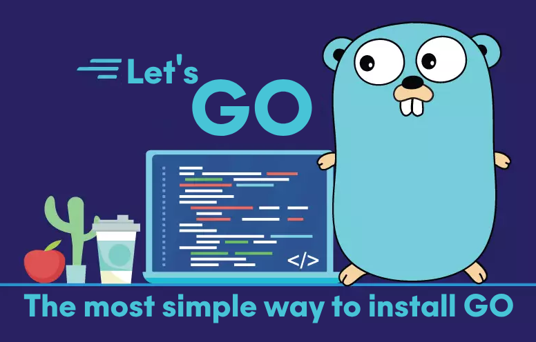

# letsGO Universal.sh



      

## Description


`letsGO_Universal.sh` is a fully portable, cross-platform Bash script for automating Go (Golang) installation, upgrading, uninstalling, and diagnostics across Linux, macOS (Intel & ARM), and Android (Termux). Designed with robustness, OPSEC-aware logging, and universal shell compatibility.

## Major Features

- ✅ **Universal Support**: Works on Linux, macOS (Intel/ARM), and Termux (Android)
- 🎯 **Shell Compatibility Mode**: Avoids array/regex reliance for maximum POSIX compatibility
- 🔄 **Install, Upgrade, or Uninstall Go** with a single script
- 🩺 **Diagnosis Mode**: Identifies multiple installations, symlink issues, GOROOT/GOPATH conflicts, etc.
- 🔁 **Version Pinning**: Install any specific Go version (e.g., `--version 1.20.5`)
- 🧪 **Environment Cleanup**: Smart removal of Go paths/exports from `.bashrc`, `.zshrc`, fish shell, etc.
- 🔗 **Symlink Management**: Creates or cleans up symbolic links for `go` and `gofmt`
- 🔐 **Safe Uninstall with Backup**: Optional removal of GOPATH with timestamped backups
- 📦 **Dependency Auto-Installer**: Ensures `curl`, `wget`, and optionally `jq` are present
- 🧰 **Verbose Logging Mode**: Rich ANSI-colored logs with optional file-based log output
- 💾 **Cross-Shell Profile Support**: Automatically updates `.bashrc`, `.zshrc`, `.bash_profile`, fish shell, etc.
- ☑️ **Verification System**: Confirms installation by checking `$GOROOT`, `go version`, and binary location
- 🧼 **Resilient Cleanup**: Detects and safely deletes broken installs, bad symlinks, or leftover exports

## Prerequisites

- A Linux, macOS, or Android (Termux) environment
- Internet connection
- (Linux/macOS only) Sudo privileges

## Requirements

The script will attempt to install any missing tools automatically, but you may need:

| Dependency          | Required For                                                 |
| ------------------- | ------------------------------------------------------------ |
| `curl`              | Downloading version metadata                                 |
| `wget`              | Fetching Go binaries                                         |
| `jq`                | (Optional) Parsing JSON for latest version (non-Termux only) |
| `git`               | Cloning this repository                                      |
| `sudo`              | Required on Linux/macOS if not running as root               |
| `bash`/`zsh`/`fish` | For profile detection and PATH setup                         |

> ✅ If you're on Termux, only `curl` and `wget` are used, and no sudo is required.

## Usage

```bash
git clone https://github.com/Darkcast/letsGO
cd letsGO
chmod +x letsGO_Universal.sh
sudo ./letsGO_Universal.sh [OPTIONS]
```

### Options

| Option            | Description                                              |
| ----------------- | -------------------------------------------------------- |
| `--version <ver>` | Install a specific Go version (e.g., `--version 1.21.0`) |
| `--uninstall`     | Completely remove Go and clean up environment variables  |
| `--diagnose`      | Check Go installation health and system setup            |
| `--verbose, -v`   | Enable detailed output                                   |
| `--log <file>`    | Save logs to a specified file                            |
| `--help, -h`      | Display usage and help information                       |

### Examples

```bash
sudo ./letsGO_Universal.sh             # Install latest version of Go
sudo ./letsGO_Universal.sh --version 1.20.5   # Install specific Go version
sudo ./letsGO_Universal.sh --uninstall        # Remove Go cleanly
sudo ./letsGO_Universal.sh --diagnose         # Check for common Go issues
```

## What’s New in v0.13 "universal-shell-compatible"

- Cross-shell profile compatibility (bash, zsh, fish, powershell)
- Full Termux (Android) support and detection
- Automated diagnostics and cleanup of broken installs/symlinks
- Improved PATH deduplication and environment variable sanitation
- Backup system for existing installs before update/removal
- No dependency on advanced Bash features — works in minimalist shells
- Portable `sed` fallback logic for Mac/BSD/Linux
- Enhanced architecture detection: x86\_64, armv6/7, aarch64, i386

## Troubleshooting

- Ensure you have an internet connection.
- Use `--verbose` and/or `--log install.log` to get more insight.
- For PATH issues, source your shell profile manually after installation:

```bash
source ~/.bashrc   # or ~/.zshrc, ~/.profile, etc.
```

## Contributing

Pull requests, suggestions, and issue reports are welcome on GitHub.

## Disclaimer

Tested on Ubuntu 24.04, macOS (ARM64), and Termux. Use at your own risk.

